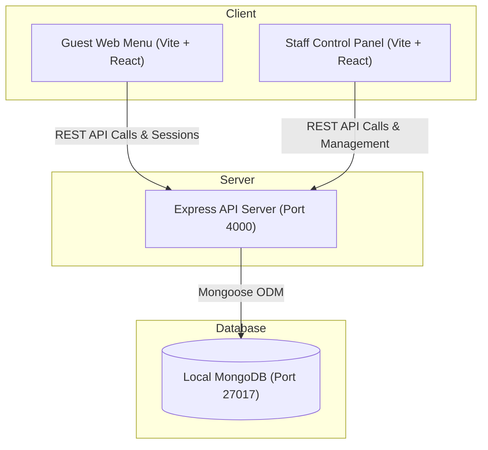

# Restaurant Management System — Running Guide

This guide describes how the Restaurant Management System was successfully set up and is **currently running** on your local machine.

---

## 🚀 Current Status: Running

Both components of the application have been successfully initialized and started in the background on your Windows system:

| Service | Local URL | Port | Process Status |
| :--- | :--- | :--- | :--- |
| **Backend API** | [http://localhost:4000](http://localhost:4000) | `4000` | **Running (Active)** |
| **Web Frontend** | [http://localhost:5173](http://localhost:5173) | `5173` | **Running (Active)** |

### 🔑 Test Credentials & Links
- **Guest Menu Demo:** [http://localhost:5173/t/TABLE01](http://localhost:5173/t/TABLE01)
- **Staff Panel URL:** [http://localhost:5173/staff](http://localhost:5173/staff)
  - **Email:** `admin@demo.local`
  - **Password:** `admin123`

---

## 🛠️ Actions Taken & Resolutions

To run the application flawlessly on Windows, the following actions were performed automatically:

1. **Resolved Native Dependency Mismatches:**
   The repository had pre-existing `node_modules` designed for a different OS or platform, causing `esbuild` and `rollup` to fail.
   - Cleared the existing `node_modules` directory.
   - Performed a clean Windows install using `npm.cmd install` to fetch the proper `@esbuild/win32-x64` and `@rollup/rollup-win32-x64-msvc` binaries.

2. **Verified MongoDB Database Service:**
   - Checked the Windows Services list and confirmed your local **MongoDB Server** is active and running on `mongodb://127.0.0.1:27017/rms`.

3. **Seeded the Database:**
   - Ran `npm.cmd run seed -w apps/api` which successfully generated:
     - 10 dine-in tables (`TABLE01` to `TABLE10`) with 4 seats each.
     - Starter menu items (appetizers, mains, desserts, drinks).
     - Default administrator credentials (`admin@demo.local`).

4. **Launched Services:**
   - Started the Express API server in the background: `npm.cmd run dev -w apps/api`
   - Started the Vite React frontend in the background: `npm.cmd run dev -w apps/web`

---

## 📂 Project Architecture



---

## 💡 How to Manage the Services Yourself

If you ever need to stop, restart, or re-run the services manually, follow these standard steps:

> [!NOTE]
> On Windows PowerShell, running raw `npm` commands can sometimes be blocked by security/execution policies. Always run commands using `npm.cmd` to bypass this constraint smoothly.

### 1. Stopping the Servers
Since the processes are running under your active Antigravity session, they will persist until the session closes or you terminate them. If you want to start them in your own external terminals, you can close this session or press `Ctrl + C` in your custom terminal windows.

### 2. Manual Start Instructions

If you need to start them fresh in two separate terminal windows:

#### **Terminal 1: Start Backend API**
```powershell
# Navigate to root directory
npm.cmd run dev -w apps/api
```

#### **Terminal 2: Start Web Frontend**
```powershell
# Navigate to root directory
npm.cmd run dev -w apps/web
```

### 3. Re-seeding the Database
If you want to clear and re-populate the database with sample dishes and tables:
```powershell
npm.cmd run seed -w apps/api
```
