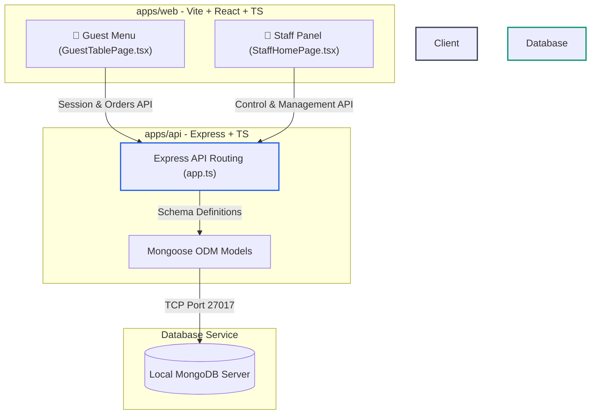

# 🍽️ Iris Cafe: Restaurant Management System (RMS) — Run & Operations Guide

Welcome to the **Iris Cafe Restaurant Management System (RMS)**. This document serves as the ultimate manual for configuring, launching, seeding, and maintaining the Iris Cafe monorepo on a local development machine.

---

## 🚀 Current System Status: ACTIVE

The application is **fully configured and actively running** in the background of your Windows local system. You can open your web browser and interact with the system immediately using the links below.

### 🌐 Live Service URL Reference
| Service | Local Endpoint | Active Port | Health Endpoint | State |
| :--- | :--- | :--- | :--- | :--- |
| **Backend Express API** | [http://localhost:4000](http://localhost:4000) | `4000` | [`/health`](http://localhost:4000/health) | **🟢 Active & Listening** |
| **Vite React Frontend** | [http://localhost:5173](http://localhost:5173) | `5173` | [Root Client](http://localhost:5173) | **🟢 Active & Listening** |
| **MongoDB Server** | `mongodb://127.0.0.1:27017/rms` | `27017` | *Local Connection* | **🟢 Running** (Service active) |

### 🔑 Test Credentials & Quick Launch Links
*   **📱 Guest Table Menu Demo:** [http://localhost:5173/t/TABLE01](http://localhost:5173/t/TABLE01)
    *   *Scan simulation for Dine-In Table 01. Guests can view categories, select dishes, customize quantities, and place active orders.*
*   **💼 Staff Control Panel:** [http://localhost:5173/staff](http://localhost:5173/staff)
    *   *Administrative hub for waiters, chefs, inventory managers, and directors.*
    *   **Email:** `admin@demo.local`
    *   **Password:** `admin123`

---

## 📂 Project Monorepo Architecture

The repository is built as an npm workspace-based monorepo, separating concerns between client-side views and server-side data models.



### Monorepo Workspaces:
1.  **`apps/web`** ([apps/web](file:///d:/Codes/restaurant-management-system/apps/web)): Client-side React dashboard.
2.  **`apps/api`** ([apps/api](file:///d:/Codes/restaurant-management-system/apps/api)): RESTful endpoint server using Mongoose.

---

## 🛠️ Step-by-Step Installation & Launch Guide

If you ever need to set up the system fresh or launch it on another development machine, follow these instructions.

### 1. Prerequisites
Ensure you have the following installed:
*   **Node.js 20+**
*   **MongoDB Community Edition** (running locally on port 27017) or a **MongoDB Atlas Cluster**.

### 2. Dependency Resolution (Windows-Specific)
Native packages like `esbuild` and `rollup` must be built/installed for the correct operating system architecture. In a Windows environment, sometimes old node modules or platform conflicts will prevent starting.

To install fresh, run the following in your terminal:
```powershell
# Navigate to the workspace root
cd restaurant-management-system

# Clean install to fetch proper Windows binaries (@esbuild/win32-x64 and @rollup/rollup-win32-x64-msvc)
npm.cmd install
```

### 3. Environment Variables Configuration
The API requires basic configuration to authenticate requests and communicate with the database. Make sure you have a `.env` file located in `apps/api/.env`.

**Example configuration (`apps/api/.env`):**
```ini
PORT=4000
MONGODB_URI=mongodb://127.0.0.1:27017/rms
GUEST_JWT_SECRET=super-secure-change-me-guest-secret-key-123
STAFF_JWT_SECRET=super-secure-change-me-staff-secret-key-456
WEB_ORIGIN=http://localhost:5173
```

---

## 🗄️ Database Seeding

To quickly populate your local MongoDB with starter data, run the built-in seeding script. This creates dine-in table layouts, core menu items across different categories, and default staff credentials.

```powershell
npm.cmd run seed -w apps/api
```

### What this seeds in your database:
*   **10 Dine-In Tables** (`TABLE01` through `TABLE10`), configured with 4 seats each.
*   **Menu Categories** (Appetizers, Main Course, Desserts, Beverages).
*   **Starter Menu Items** with descriptive names, price, descriptions, and availability.
*   **Administrator User Account** (`admin@demo.local` with password `admin123`).

---

## 🔄 Run & Management Scripts

For daily development, run the backend and frontend simultaneously or in separate terminal sessions.

### Starting Everything Manually

#### **Terminal 1: Express API Server**
```powershell
# Starts TSX Watcher on http://localhost:4000
npm.cmd run dev -w apps/api
```

#### **Terminal 2: Vite React Frontend**
```powershell
# Starts Vite Server on http://localhost:5173
npm.cmd run dev -w apps/web
```

---

## 🌟 Capabilities & System Features

The Iris Cafe system includes fully realized modules designed to handle all aspects of cafe and restaurant operations:

### 1. Guest Ordering Flow (`apps/web/src/pages/GuestTablePage.tsx`)
*   **QR-Code Simulation:** Accessing `/t/:tableSlug` starts a local dining session.
*   **Self-Ordering:** Guests add items, modify quantities, and place orders directly to the kitchen.
*   **State Persistence:** Active session state and cart totals remain sync'ed with the dining table state.

### 2. Table Layout & Service (`apps/web/src/pages/StaffTablesPage.tsx`)
*   **Real-time Grid:** A glassmorphic grid mapping out all dine-in tables.
*   **Color-Coded Statuses:** Visually distinguish between empty, dining, billing, or dirty tables.
*   **Table Servicing:** Staff can access active tables, add manual orders, process bills, and clear tables.

### 3. Kitchen & Order Dashboard (`apps/web/src/pages/StaffOrdersPage.tsx`)
*   **Order Tracker:** A robust status board detailing new, preparing, served, and paid orders.
*   **Status Transitions:** Waiters and chefs can move orders dynamically from `Pending` ➡️ `Preparing` ➡️ `Ready` ➡️ `Served`.

### 4. Inventory Management (`apps/web/src/pages/StaffInventoryPage.tsx`)
*   **Asset Auditing:** Lists raw ingredients, stock counts, and units.
*   **Threshold Warnings:** Visual highlights for items running low or out of stock.
*   **Stock Adjustment:** Form controls to restock items and manage suppliers directly.

### 5. Cafe Reviews & Feedback (`apps/web/src/pages/StaffReviewsPage.tsx`)
*   **Rating Aggregator:** Shows overall service score, food quality, and ambience metrics.
*   **Review Ledger:** Log of guest reviews with star ratings and detailed descriptions.

### 6. Staff & Payroll Management (`apps/web/src/pages/StaffEmployeesPage.tsx`)
*   **Staff Registry:** Detailed files on administrative, service, and culinary team members.
*   **Shift & Attendance Roster:** Check-in history, shift tracking, and payroll summary reports.

---

## 💡 Troubleshooting & Windows Tips

### ⚡ Windows Execution Policies
If you get a script blocked error when running commands in PowerShell:
*   Always use the `.cmd` extension to execute node utilities: `npm.cmd` rather than `npm`.
*   Alternatively, set execution policies for your current PowerShell context:
    ```powershell
    Set-ExecutionPolicy -ExecutionPolicy RemoteSigned -Scope Process
    ```

### 🔒 Re-installing Node Binaries
If Node throws a platform-specific binary error (e.g. `esbuild.exe` or `rollup` cannot run):
```powershell
# Force re-build local platforms
npm rebuild
```

### 🧭 Port Conflicts & Mongoose Index Warning (Troubleshooting)

If you see an error like `Error: listen EADDRINUSE: address already in use :::4000` when starting the API, or a Mongoose warning about a duplicate index for `tableId`, try the steps below.

- **Find which process is using port 4000** (PowerShell / CMD):

```powershell
# PowerShell: show TCP connection owning process
Get-NetTCPConnection -LocalPort 4000 | Select-Object LocalAddress,LocalPort,State,OwningProcess
Get-Process -Id (Get-NetTCPConnection -LocalPort 4000).OwningProcess

# CMD: list sockets with PID
netstat -ano | findstr :4000
```

- **If you found a PID and want to stop just that process:**

```powershell
# Replace <PID> with the OwningProcess value
taskkill /PID <PID> /F
```

- **If you prefer to start the API on a different port temporarily:**

```powershell
#$env:PORT=4001; npm.cmd run dev -w apps/api
```

or (CMD):

```
set PORT=4001 && npm.cmd run dev -w apps/api
```

- **Duplicate Mongoose index warning**

You may also see a Mongoose warning like `Duplicate schema index on {"tableId":1} found.` This usually means an index was defined twice (for example, `index: true` on a field and a separate `schema.index(...)` call). The project was updated to remove the inline `index: true` on `tableId` in the DiningSession model. The file to check or update is:

[apps/api/src/models/DiningSession.ts](apps/api/src/models/DiningSession.ts)

If you have local changes that reintroduce the inline index, remove `index: true` from the `tableId` field and keep the explicit `schema.index(...)` declarations instead.


### 🐳 Running with Docker
If you prefer not to install MongoDB natively on Windows, you can spin up the MongoDB service inside a Docker container:
```powershell
docker compose -f docker/docker-compose.yml up -d
```
The database connection URL `mongodb://127.0.0.1:27017/rms` will work identically.
